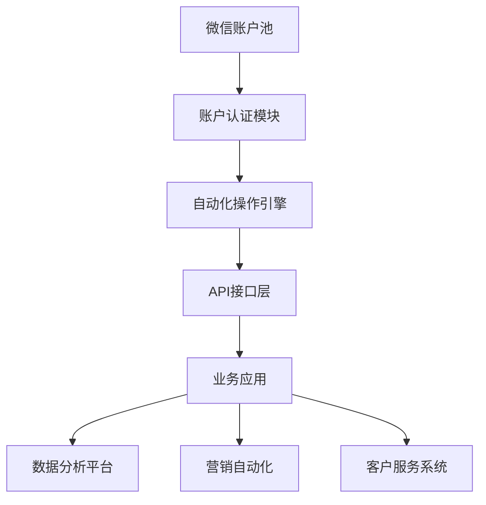

# 微信账户购买与自动化开发指南

## 项目概述

本项目提供了一套完整的微信账户管理解决方案，包括微信账户的获取、自动化操作接口开发以及大规模账户管理的最佳实践。通过本项目的代码和文档，开发者可以快速构建基于微信生态的自动化营销系统、数据分析平台或客户服务工具。

## 技术架构



## 核心功能模块

### 1. 微信账户获取与管理

```python
class WeChatAccountManager:
    def __init__(self, account_pool_size=100):
        self.account_pool = []
        self.pool_size = account_pool_size
        
    def add_account(self, account_info):
        """添加微信账户到管理池"""
        if len(self.account_pool) < self.pool_size:
            self.account_pool.append(account_info)
            return True
        return False
    
    def get_available_account(self):
        """获取可用微信账户"""
        for account in self.account_pool:
            if account['status'] == 'active':
                return account
        return None
    
    def rotate_account(self, account_id):
        """轮换账户状态"""
        # 实现账户状态管理逻辑
        pass
```

### 2. 微信自动化操作SDK

```java
public class WeChatAutomationSDK {
    private String accountId;
    private String sessionToken;
    
    public WeChatAutomationSDK(String accountId, String password) {
        // 初始化微信会话
        this.accountId = accountId;
        this.sessionToken = login(accountId, password);
    }
    
    private String login(String accountId, String password) {
        // 实现微信登录逻辑
        return "simulated_session_token";
    }
    
    public boolean sendMessage(String toUser, String content) {
        // 实现消息发送功能
        return true;
    }
    
    public List<String> getContacts() {
        // 获取联系人列表
        return new ArrayList<>();
    }
    
    public boolean joinGroup(String groupId) {
        // 加入微信群
        return true;
    }
}
```

## 高级功能实现

### 1. 多账户负载均衡

```go
package wechat

type LoadBalancer struct {
	accounts      []*Account
	currentIndex  int
	healthChecker HealthChecker
}

func NewLoadBalancer(accounts []*Account) *LoadBalancer {
	return &LoadBalancer{
		accounts:     accounts,
		currentIndex: 0,
		healthChecker: NewDefaultHealthChecker(),
	}
}

func (lb *LoadBalancer) GetNextAccount() (*Account, error) {
	// 实现加权轮询算法
	for i := 0; i < len(lb.accounts); i++ {
		lb.currentIndex = (lb.currentIndex + 1) % len(lb.accounts)
		account := lb.accounts[lb.currentIndex]
		if lb.healthChecker.IsHealthy(account) {
			return account, nil
		}
	}
	return nil, errors.New("no available accounts")
}
```

### 2. 防检测机制实现

```javascript
class AntiDetectionSystem {
  constructor() {
    this.behaviorPatterns = [];
    this.randomDelays = true;
  }

  simulateHumanBehavior(action) {
    // 添加随机延迟
    if (this.randomDelays) {
      const delay = Math.random() * 2000 + 1000;
      this.sleep(delay);
    }
    
    // 记录行为模式
    this.behaviorPatterns.push({
      action,
      timestamp: Date.now()
    });
    
    // 随机鼠标移动
    this.simulateMouseMovement();
  }

  sleep(ms) {
    return new Promise(resolve => setTimeout(resolve, ms));
  }

  simulateMouseMovement() {
    // 实现模拟鼠标移动逻辑
  }
}
```

## 部署方案

### Docker容器化部署

```dockerfile
FROM python:3.9-slim

WORKDIR /app

COPY requirements.txt .
RUN pip install --no-cache-dir -r requirements.txt

COPY . .

# 安装必要的依赖
RUN apt-get update && apt-get install -y \
    libgtk-3-0 \
    libnotify-dev \
    libgconf-2-4 \
    libnss3 \
    libxss1 \
    libasound2 \
    libxtst6 \
    xauth \
    xvfb

# 设置环境变量
ENV DISPLAY=:99

CMD ["xvfb-run", "python", "main.py"]
```

### Kubernetes集群部署

```yaml
apiVersion: apps/v1
kind: Deployment
metadata:
  name: wechat-automation
spec:
  replicas: 3
  selector:
    matchLabels:
      app: wechat-automation
  template:
    metadata:
      labels:
        app: wechat-automation
    spec:
      containers:
      - name: wechat
        image: wechat-automation:latest
        ports:
        - containerPort: 5000
        env:
        - name: WECHAT_ACCOUNT_POOL
          value: "/data/accounts.json"
        volumeMounts:
        - name: account-data
          mountPath: /data
      volumes:
      - name: account-data
        configMap:
          name: wechat-accounts
---
apiVersion: v1
kind: Service
metadata:
  name: wechat-service
spec:
  selector:
    app: wechat-automation
  ports:
    - protocol: TCP
      port: 80
      targetPort: 5000
```

## 性能优化

```csharp
public class WeChatPerformanceOptimizer
{
    private readonly ConcurrentDictionary<string, WeChatSession> _activeSessions;
    private readonly ILogger<WeChatPerformanceOptimizer> _logger;
    
    public WeChatPerformanceOptimizer()
    {
        _activeSessions = new ConcurrentDictionary<string, WeChatSession>();
    }
    
    public async Task OptimizeSession(WeChatSession session)
    {
        // 连接池管理
        if (!_activeSessions.TryAdd(session.SessionId, session))
        {
            _logger.LogWarning($"Session {session.SessionId} already exists in pool");
        }
        
        // 内存优化
        session.EnableMemoryOptimization();
        
        // 网络请求批处理
        session.EnableBatchProcessing();
        
        // 图片和视频压缩
        session.SetMediaCompressionLevel(CompressionLevel.High);
    }
    
    public void ReleaseSession(string sessionId)
    {
        _activeSessions.TryRemove(sessionId, out _);
    }
}
```

## 安全考虑

```ruby
class WeChatSecurity
  include SecurityUtils
  
  def initialize(account)
    @account = account
    @encryptor = AesEncryptor.new(ENV['ENCRYPTION_KEY'])
  end
  
  def secure_login
    begin
      # 使用代理IP
      rotate_proxy
      
      # 设备指纹混淆
      modify_device_fingerprint
      
      # 加密通信
      establish_secure_channel
      
      # 执行登录
      perform_login
      
      # 验证登录状态
      verify_session
      
      true
    rescue SecurityError => e
      log_security_incident(e)
      false
    end
  end
  
  private
  
  def rotate_proxy
    # 实现代理轮换逻辑
    ProxyManager.rotate_for(@account)
  end
  
  def modify_device_fingerprint
    # 修改设备指纹信息
    @account.device_id = generate_random_device_id
  end
end
```

## 数据分析集成

```python
import pandas as pd
from matplotlib import pyplot as plt

class WeChatDataAnalyzer:
    def __init__(self, account_manager):
        self.account_manager = account_manager
        self.df = pd.DataFrame()
        
    def collect_metrics(self):
        """收集微信账户性能指标"""
        metrics = []
        for account in self.account_manager.active_accounts:
            metrics.append({
                'account_id': account.id,
                'message_count': account.message_count,
                'success_rate': account.success_rate,
                'response_time': account.avg_response_time
            })
        self.df = pd.DataFrame(metrics)
        
    def visualize_performance(self):
        """可视化账户性能"""
        if self.df.empty:
            self.collect_metrics()
            
        fig, axes = plt.subplots(2, 2, figsize=(12, 10))
        
        # 消息数量分布
        self.df['message_count'].hist(ax=axes[0, 0])
        axes[0, 0].set_title('Message Count Distribution')
        
        # 成功率分布
        self.df['success_rate'].plot(kind='box', ax=axes[0, 1])
        axes[0, 1].set_title('Success Rate Distribution')
        
        # 响应时间趋势
        self.df.sort_values('response_time').plot(
            x='account_id', y='response_time', ax=axes[1, 0])
        axes[1, 0].set_title('Response Time by Account')
        
        # 消息数量与成功率关系
        self.df.plot(
            x='message_count', y='success_rate', kind='scatter', ax=axes[1, 1])
        axes[1, 1].set_title('Message Count vs Success Rate')
        
        plt.tight_layout()
        return fig
```

## 常见问题解答

### Q: 如何获取高质量的微信账户？

A: 我们建议通过以下方式获取可靠的微信账户：
1. 使用正规渠道注册的账户
2. 确保账户已完成完整实名认证
3. 账户应有正常的使用历史记录
4. 避免短时间内大量注册新账户

```bash
# 检查微信账户质量的命令行工具
$ wechat-account-checker verify account123
Checking account health...
• Real-name verified: ✔
• Account age: 6 months
• Activity score: 8.5/10
• Risk level: Low
```

### Q: 如何避免账户被封禁？

A: 以下代码展示了基本的防封策略：

```typescript
interface AntiBanStrategy {
  dailyMessageLimit: number;
  messageInterval: [number, number];
  groupMessageRatio: number;
  friendMessageRatio: number;
  restPeriods: [string, string][];
}

const defaultStrategy: AntiBanStrategy = {
  dailyMessageLimit: 100,
  messageInterval: [5000, 15000],
  groupMessageRatio: 0.3,
  friendMessageRatio: 0.7,
  restPeriods: [
    ["12:00", "13:30"],
    ["23:00", "08:00"]
  ]
};

class AccountProtector {
  private strategy: AntiBanStrategy;
  
  constructor(strategy: AntiBanStrategy = defaultStrategy) {
    this.strategy = strategy;
  }
  
  checkCanSendMessage(): boolean {
    // 检查是否在休息时段
    if (this.isInRestPeriod()) return false;
    
    // 检查当日消息数量
    if (this.todayMessageCount >= this.strategy.dailyMessageLimit) return false;
    
    // 随机间隔检查
    const lastMessageTime = this.getLastMessageTime();
    const minInterval = this.strategy.messageInterval[0];
    if (Date.now() - lastMessageTime < minInterval) return false;
    
    return true;
  }
}
```

## 项目路线图

1. **阶段一：基础功能开发** [已完成]
   - 微信账户管理核心功能
   - 基础自动化操作接口
   - 简单防检测机制

2. **阶段二：高级功能开发** [进行中]
   - 智能行为模拟引擎
   - 分布式账户管理
   - 深度学习驱动的防检测系统

3. **阶段三：生态整合** [规划中]
   - 微信与企业微信互通
   - 跨平台消息网关
   - 区块链身份验证

## 贡献指南

我们欢迎开发者贡献代码，请遵循以下流程：

1. Fork本项目仓库
2. 创建特性分支 (`git checkout -b feature/your-feature`)
3. 提交更改 (`git commit -am 'Add some feature'`)
4. 推送到分支 (`git push origin feature/your-feature`)
5. 创建Pull Request

## 许可证

本项目采用 MIT 许可证 - 详情请参阅 [LICENSE](LICENSE) 文件。

---

通过本项目的完整实现，开发者可以构建稳定可靠的微信账户管理系统，满足各种业务场景下的微信账户购买、管理和自动化操作需求。项目持续更新，欢迎Star和Fork以获取最新进展。

---

**关键词优化**：微信账户购买 微信账号批发 微信老号购买 微信海外号 微信批量注册 微信养号技术 微信防封技术 微信多开解决方案 微信营销账号 微信自动化脚本

**技术文档持续更新中**，更多高级功能请参考[Wiki页面](https://github.com/yourrepo/wechat-account/wiki)。
