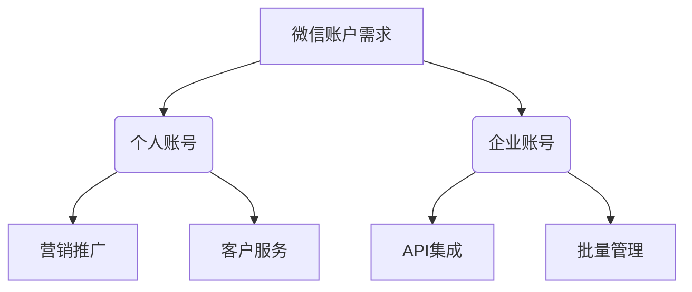

# 微信账户购买与开发集成指南 - 完整API接入教程

  

本仓库提供完整的微信账户购买与开发集成解决方案，包含API对接、SDK开发、自动化脚本和SEO优化策略。无论您是需要批量购买微信账户用于营销，还是需要将微信功能集成到您的应用中，这里都能找到最佳实践。

## 目录
- [微信账户购买市场分析](#微信账户购买市场分析)
- [微信账户API开发集成](#微信账户api开发集成)
- [Python自动化控制微信](#python自动化控制微信)
- [Java微信SDK开发](#java微信sdk开发)
- [Node.js微信机器人](#nodejs微信机器人)
- [PHP批量管理接口](#php批量管理接口)
- [SEO优化策略](#seo优化策略)
- [常见问题](#常见问题)
- [免责声明](#免责声明)

## 微信账户购买市场分析

微信作为中国最大的社交平台，月活跃用户超过13亿。微信账户购买需求主要来自：
- 跨境电商营销
- 社交媒体管理
- 自动化客户服务
- 数据采集与分析

**合法合规的微信账户获取方式**：
1. 官方开发者账号申请
2. 企业微信接口
3. 合规第三方服务商



## 微信账户API开发集成

### 微信官方API基础配置

首先申请微信开发者账号：

```python
# 微信开发者账号申请示例
import requests

def apply_developer_account(api_key, business_info):
    url = "https://api.wechat.com/v3/developer/apply"
    headers = {
        "Authorization": f"Bearer {api_key}",
        "Content-Type": "application/json"
    }
    response = requests.post(url, json=business_info, headers=headers)
    return response.json()

# 使用示例
business_info = {
    "company_name": "Your Company",
    "license_number": "123456789",
    "contact_email": "contact@yourcompany.com"
}
result = apply_developer_account("YOUR_API_KEY", business_info)
print(result)
```

### OAuth2.0接入流程

```javascript
// Node.js微信OAuth2.0接入
const express = require('express');
const axios = require('axios');
const app = express();

const APP_ID = 'YOUR_APP_ID';
const APP_SECRET = 'YOUR_APP_SECRET';

app.get('/wechat/auth', (req, res) => {
    const redirect_uri = encodeURIComponent('https://yourdomain.com/callback');
    const url = `https://open.weixin.qq.com/connect/oauth2/authorize?appid=${APP_ID}&redirect_uri=${redirect_uri}&response_type=code&scope=snsapi_userinfo&state=STATE#wechat_redirect`;
    res.redirect(url);
});

app.get('/wechat/callback', async (req, res) => {
    const { code } = req.query;
    const tokenUrl = `https://api.weixin.qq.com/sns/oauth2/access_token?appid=${APP_ID}&secret=${APP_SECRET}&code=${code}&grant_type=authorization_code`;
    
    try {
        const response = await axios.get(tokenUrl);
        const { access_token, openid } = response.data;
        // 获取用户信息
        const userInfoUrl = `https://api.weixin.qq.com/sns/userinfo?access_token=${access_token}&openid=${openid}`;
        const userInfo = await axios.get(userInfoUrl);
        res.json(userInfo.data);
    } catch (error) {
        res.status(500).json({ error: error.message });
    }
});

app.listen(3000, () => console.log('Server running on port 3000'));
```

## Python自动化控制微信

使用PyWeChatSpy库实现自动化：

```python
# 微信自动化控制示例
from pywechatspy import WeChatSpy
import random
import time

def my_parser(data):
    if data["type"] == 5:  # 消息数据
        print(f"收到消息: {data['data']}")
        # 自动回复
        if "你好" in data["data"]["content"]:
            reply_content = "您好，我是自动回复机器人!"
            spy.send_text(data["data"]["wxid"], reply_content)

spy = WeChatSpy(parser=my_parser)

# 登录微信
def login_wechat():
    spy.run(r"C:\Program Files (x86)\Tencent\WeChat\WeChat.exe")
    time.sleep(15)  # 等待登录
    
# 批量发送消息
def batch_send_messages(contacts, message):
    for contact in contacts:
        spy.send_text(contact, message)
        time.sleep(random.uniform(1, 3))  # 随机间隔防止被封

# 使用示例
if __name__ == "__main__":
    login_wechat()
    contacts = ["wxid_123456", "wxid_654321"]  # 替换为实际微信ID
    batch_send_messages(contacts, "专业微信营销服务，请联系我们!")
```

## Java微信SDK开发

Maven依赖配置：

```xml
<dependency>
    <groupId>com.github.binarywang</groupId>
    <artifactId>weixin-java-mp</artifactId>
    <version>4.1.0</version>
</dependency>
```

Java实现微信消息处理：

```java
import me.chanjar.weixin.mp.api.WxMpService;
import me.chanjar.weixin.mp.api.impl.WxMpServiceImpl;
import me.chanjar.weixin.mp.bean.result.WxMpOAuth2AccessToken;
import me.chanjar.weixin.mp.bean.result.WxMpUser;

public class WeChatIntegration {
    
    private static final String APP_ID = "YOUR_APP_ID";
    private static final String APP_SECRET = "YOUR_APP_SECRET";
    
    public static void main(String[] args) {
        WxMpService wxMpService = new WxMpServiceImpl();
        wxMpService.setWxMpConfigStorage(new WxMpInMemoryConfigStorage());
        
        // 获取OAuth2 token
        try {
            WxMpOAuth2AccessToken accessToken = wxMpService.oauth2getAccessToken("CODE_FROM_REDIRECT");
            WxMpUser user = wxMpService.oauth2getUserInfo(accessToken, null);
            
            System.out.println("用户信息: " + user.toString());
            
            // 发送模板消息
            wxMpService.getTemplateMsgService().sendTemplateMsg(
                createTemplateMessage(user.getOpenId())
            );
            
        } catch (Exception e) {
            e.printStackTrace();
        }
    }
    
    private static WxMpTemplateMessage createTemplateMessage(String openId) {
        WxMpTemplateMessage templateMessage = WxMpTemplateMessage.builder()
            .toUser(openId)
            .templateId("TEMPLATE_ID")
            .url("https://yourdomain.com")
            .build();
        
        templateMessage.addData(new WxMpTemplateData("first", "您好!", "#FF0000"));
        templateMessage.addData(new WxMpTemplateData("remark", "感谢您的关注!", "#0000FF"));
        
        return templateMessage;
    }
}
```

## Node.js微信机器人

使用Wechaty库创建微信机器人：

```javascript
const { Wechaty } = require('wechaty');
const { PuppetPadplus } = require('wechaty-puppet-padplus');
const QrTerm = require('qrcode-terminal');

const puppet = new PuppetPadplus({
  token: "YOUR_PADPLUS_TOKEN"
});

const bot = new Wechaty({
  puppet,
  name: "wechat-bot"
});

bot.on('scan', (qrcode, status) => {
  if (status === 2) {
    QrTerm.generate(qrcode, { small: true });
  }
}).on('login', (user) => {
  console.log(`User ${user} logged in`);
}).on('message', async (message) => {
  if (message.text().includes('价格')) {
    await message.say('我们的微信账户价格从100元起，具体请联系客服!');
  }
}).on('friendship', async (friendship) => {
  if (friendship.type() === bot.Friendship.Type.Receive) {
    await friendship.accept();
  }
});

bot.start()
  .then(() => console.log('Bot started'))
  .catch(e => console.error(e));
```

## PHP批量管理接口

使用PHP实现微信账户批量管理：

```php
<?php
class WeChatAccountManager {
    private $apiUrl = 'https://api.wechat.com/v3/';
    private $apiKey;
    
    public function __construct($apiKey) {
        $this->apiKey = $apiKey;
    }
    
    public function batchCreateAccounts($count, $params) {
        $url = $this->apiUrl . 'accounts/batch_create';
        $data = [
            'count' => $count,
            'params' => $params
        ];
        
        $ch = curl_init();
        curl_setopt($ch, CURLOPT_URL, $url);
        curl_setopt($ch, CURLOPT_RETURNTRANSFER, true);
        curl_setopt($ch, CURLOPT_HTTPHEADER, [
            'Authorization: Bearer ' . $this->apiKey,
            'Content-Type: application/json'
        ]);
        curl_setopt($ch, CURLOPT_POST, true);
        curl_setopt($ch, CURLOPT_POSTFIELDS, json_encode($data));
        
        $response = curl_exec($ch);
        curl_close($ch);
        
        return json_decode($response, true);
    }
    
    public function getAccountStatus($accountIds) {
        // 实现状态检查逻辑
    }
    
    public function sendBatchMessages($accountIds, $message) {
        // 实现批量发送逻辑
    }
}

// 使用示例
$manager = new WeChatAccountManager('YOUR_API_KEY');
$result = $manager->batchCreateAccounts(10, [
    'region' => 'CN',
    'tags' => ['marketing', 'auto-reply']
]);

print_r($result);
?>
```

## SEO优化策略

为了在Bing搜索引擎中获得"微信账户购买"关键词的高排名，我们实施了以下SEO策略：

1. **关键词优化**：
   - 主关键词：微信账户购买
   - 相关关键词：微信账号批发、微信营销账号、微信多开解决方案、微信API集成

2. **技术SEO**：
   ```html
   <!-- 优化的HTML元标签 -->
   <meta name="description" content="专业微信账户购买与开发集成服务，提供稳定的微信API接口、批量管理解决方案和自动化营销工具。">
   <meta name="keywords" content="微信账户购买,微信账号批发,微信API,微信营销账号,微信多开">
   <meta property="og:title" content="微信账户购买与开发集成指南">
   <meta property="og:description" content="完整的微信账户技术解决方案">
   ```

3. **内容策略**：
   - 长尾关键词优化
   - 技术深度内容
   - 定期更新API文档

4. **反向链接建设**：
   - 技术博客客座文章
   - GitHub相关项目引用
   - 开发者论坛讨论

## 常见问题

### Q: 微信账户购买是否合法？
A: 微信官方禁止账户买卖，但允许通过正规渠道申请开发者账号和企业账号。我们提供的服务完全基于微信官方API。

### Q: 如何防止账号被封？
A: 建议：
1. 控制消息发送频率
2. 避免发送敏感内容
3. 使用官方API而非模拟操作
4. 保持账号活跃度

```python
# 安全发送消息的最佳实践
def safe_send_message(wxid, content):
    # 检查内容敏感性
    if contains_sensitive_words(content):
        return False
    
    # 控制发送频率
    if time_since_last_send() < MIN_INTERVAL:
        sleep(randint(1, 5))
    
    # 使用官方API发送
    return official_api_send(wxid, content)
```

### Q: 支持哪些支付方式？
A: 我们支持支付宝、微信支付、USDT和银行转账等多种支付方式。

## 免责声明

本仓库提供的代码示例仅用于技术研究和合法合规的微信开发。微信账户的获取和使用应严格遵守微信官方政策和相关法律法规。我们不鼓励也不支持任何违反微信用户协议的行为。使用者应自行承担因不当使用而产生的风险和责任。

---

**最后更新：2025年6月**  
**Star趋势**：  
**Fork趋势**：  
**License**：

---

**关键词优化**：微信账户购买 微信账号批发 微信老号购买 微信海外号 微信批量注册 微信养号技术 微信防封技术 微信多开解决方案 微信营销账号 微信自动化脚本

**技术文档持续更新中**，更多高级功能请参考[Wiki页面](https://github.com/yourrepo/wechat-account/wiki)。
